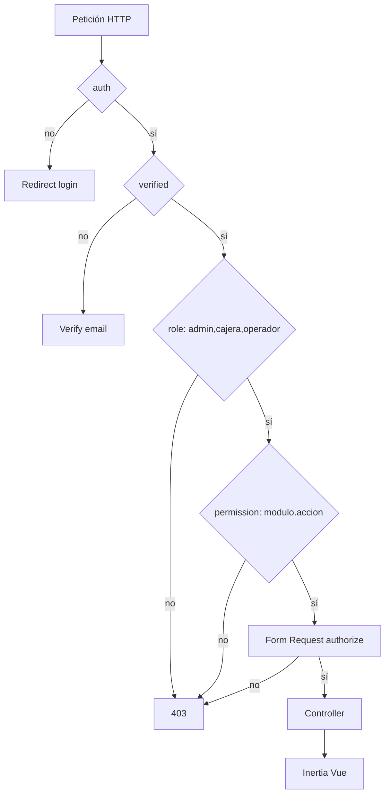

# Referencia — Arquitectura de seguridad ISINUTA

## Diagrama de capas



## Tablas de base de datos

| Tabla | Propósito |
|-------|-----------|
| `users` | Cuenta (`estado`: activo/inactivo) |
| `roles` | Tipos: admin, cajera, operador |
| `permisos` | Acciones granulares |
| `rol_usuario` | Usuario ↔ rol |
| `permiso_rol` | Rol ↔ permiso |

## Roles y permisos (resumen)

| Rol | Gestión usuarios | Panel | Pagos | Afiliados |
|-----|------------------|-------|-------|-----------|
| admin | sí | sí | sí | sí |
| cajera | no | sí | sí | sí |
| operador | no | sí (legacy) | sí | sí |

Permiso exclusivo de admin para usuarios: `usuarios.gestionar`.

Definición completa: `app/Enums/Permission.php` → métodos `valuesForAdministrador()`, `valuesForCajera()`.

## Middleware registrados

Alias típicos en `bootstrap/app.php`:

- `role` → `EnsureUserHasRole`
- `permission` → `EnsureUserHasPermission`

Uso en rutas:

```php
Route::middleware(['auth', 'verified', 'role:admin,cajera,operador'])->group(function () {
    Route::middleware('permission:usuarios.gestionar')->group(function () {
        Route::get('usuarios', ...);
    });
});
```

**Nota:** `permission:a,b` usa lógica **OR** (basta uno).

## User — métodos clave

```php
$user->hasRole(Role::ADMIN);
$user->hasAnyRole([Role::CAJERA, Role::OPERADOR]);
$user->hasPermission('usuarios.gestionar');
$user->isAdmin();          // bypass de permisos
$user->isActivo();         // estado activo/inactivo
$user->etiquetaRol();      // Administrador | Cajera | Operador
$user->canAccessPanel();   // activo + rol válido
```

## Fortify — puntos de extensión

| Archivo | Responsabilidad |
|---------|-----------------|
| `config/fortify.php` | Features habilitados (sin registro público) |
| `FortifyServiceProvider` | Vistas login, rate limit, authenticateUsing |
| `LoginResponse` | Redirección post-login según permisos |
| `CreateNewUser` | Solo si registro estuviera habilitado |

Bloqueo de inactivos (patrón del proyecto):

```php
Fortify::authenticateUsing(function (Request $request) {
    $user = User::where('email', $request->email)->first();
    if (! $user || ! Hash::check($request->password, $user->password)) {
        return null;
    }
    if (! $user->isActivo()) {
        throw ValidationException::withMessages([
            Fortify::username() => ['Su cuenta está inactiva. Contacte al administrador.'],
        ]);
    }
    return $user;
});
```

## UsuarioController — reglas de negocio

| Acción | Regla |
|--------|-------|
| `store` | Solo admin; crea con estado activo + equipo personal |
| `update` | No auto-degradar admin; no último admin |
| `updateEstado` | No auto-desactivar; no desactivar último admin activo |

## Frontend (Inertia)

Props compartidas en `HandleInertiaRequests`:

```php
'auth' => [
    'user' => $user,
    'roles' => fn () => $user?->rolesNombres() ?? [],
    'permisos' => fn () => $user?->permissionsNombres() ?? [],
    'etiqueta_rol' => fn () => $user?->etiquetaRol(),
    'isAdmin' => fn () => $user?->isAdmin() ?? false,
],
```

Composable en Vue: `usePermissions()` → `can('pagos.gestionar')`.

**Importante:** `can()` en Vue es UX; la ruta backend debe rechazar igual.

## Tests mínimos (UsuarioGestionTest)

| Test | Assert |
|------|--------|
| Admin accede index | `assertOk()` |
| Cajera index | `assertForbidden()` |
| Admin crea usuario | redirect + `assertDatabaseHas` |
| Cajera crea usuario | `assertForbidden()` |
| Inactivo login | `assertSessionHasErrors` + `assertGuest()` |
| Desactivar otro usuario | `assertSessionHas('success')` |
| Auto-desactivación | `assertSessionHas('error')` |

## Brechas conocidas (para discutir en clase)

| Tema | Severidad | Estado |
|------|-----------|--------|
| Sesión activa tras desactivar | Alta | Pendiente middleware |
| Exposición modelo User completo en Inertia | Media | Mejorable con DTO |
| Sin UserPolicy | Media | Opcional |
| Último admin puede borrarse en settings | Media | Pendiente |

Usar esta tabla para ejercicio de auditoría con estudiantes.
